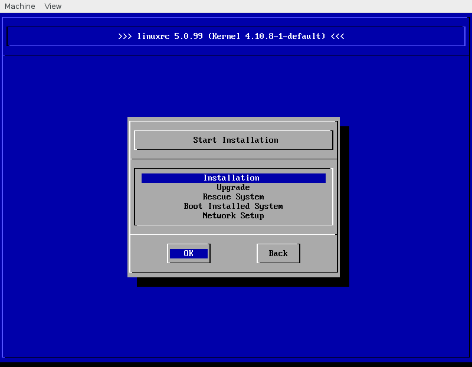

# linuxrc

linuxrc is run as the first part of the SUSE installation process, right
after the linux kernel has been loaded - before
the installer [YaST](https://en.opensuse.org/Portal:YaST) runs.

Its task is to setup the installation environment, download the installer YaST, and start the installation.
Normally it does everything automatically and you don't see anything of linuxrc except for some status messages.

But there is also a manual mode where it presents you with a set of menus to setup the installation environment
and start the installation.

You can activate this mode by booting with the boot option `manual=1`.

There are actually two variants. One is a curses-like interface that looks like this:



The other is much simpler for line-oriented terminals. It is enabled with the option `linemode=1` and looks like this:

```
>>> linuxrc 5.0.99 (Kernel 4.10.8-1-default) <<<

Main Menu

0) <-- Back <--
1) Start Installation          
2) Settings               
3) Expert                
4) Exit or Reboot            

> 1

Start Installation

0) <-- Back <--
1) Installation              
2) Upgrade                
3) Rescue System             
4) Boot Installed System         
5) Network Setup             

> 
```

Both variants are functionally identical. You can use the one that suits you best,

As you've noticed, linuxrc can be controlled using a number of boot options. Quite a big number, actually.

In fact, linuxrc's functionality is fully covered by boot options. See [SBD:Linuxrc](https://en.opensuse.org/SDB:Linuxrc)
for reference.

## Build Requirements
Compiling linuxrc will require some additional dependencies.

For example on openSUSE/SUSE distributions run:
```sh
zypper install e2fsprogs-devel hwinfo-devel libblkid-devel libcurl-devel readline-devel libmediacheck-devel
```
## Debugging

### Running on a normal system

Linuxrc can be run on a normal system. It detects this and runs in a test mode, trying not to disrupt your system too much.
For instance, it will not configure your network and be very careful not to take over your system in any way..

This also means you cannot test everything this way (for example the network setup code).

When you run linuxrc on a normal system, parameters are passed as commandline parameters, for example:

```sh
linuxrc linemode=0 manual=1 linuxrc.debug=1
```

When running it the first time you might notice that there's no obvious way to exit linuxrc. So, here are a few tips:

> ### Useful Shortcuts
>
> **In Window-Mode** (`linemode=0`)
>
> * ctrl+c then 'q' - exit linuxrc
> * ctrl+c then 'c' - change config
> * ctrl+c then 'i' - show info detected by linuxrc
> * ctrl+c then 's' - start shell
>
> **In Line-Mode** (`linemode=1`)
>
> * There's a hidden menu available. You can reach it by entering the letter `x` (instead of a number) from any menu.
> This menu looks like this:
>
> ```
> Linuxrc extras
> 
> 0) <-- Back <--
> 1) Show config         
> 2) Change config        
> 3) Start shell         
> 4) Run command         
> 5) Quit linuxrc         
> 
> > 
> ```

### Logging

linuxrc logs to /var/log/linuxrc.log.
To capture a log with maximum verbosity, including the source code location of the logging call,
use these linuxrc params:

```sh
linuxrc.debug=4,trace
```

linuxrc will also try to log (less verbose) to /dev/tty3. You can redirect this to another location if you need.
For example, on a serial console it might be helpful to log to the current console:

```
linuxrc.log=/dev/console
```

## Testing the Installation

A regular SUSE installation DVD gets built via linuxrc.rpm,
then installation-images.rpm,
then a [KIWI image build](https://build.opensuse.org/package/show/openSUSE:Factory/_product:openSUSE-dvd5-dvd-x86_64).

For testing a shortcut is available: mksusecd
([GitHub](https://github.com/openSUSE/mksusecd),
[OBS](https://build.opensuse.org/package/show/system:install:head/mksusecd)).

Use:

```sh
mksusecd --initrd ./linuxrc.rpm --create $OUTPUT_ISO $INPUT
```

or, without an RPM:

```sh
make
mkdir /tmp/initrd
cp linuxrc /tmp/initrd/init
mksusecd --initrd /tmp/initrd --create $OUTPUT_ISO $INPUT
```

Forgetting about the correct shared libraries usually leads to crashes and backtraces printed on the terminal.
When compiling linuxrc on a system different from the one in the input iso, make sure that shared libraries are passed with matching versions; typically you'll need libreadline.so and libhd.so but your mileage may vary. In the following example, linuxrc was compiled on Leap 42.1 to build against Tumbleweed; the versions of the two libraries were not matching on the two versions of openSUSE so the correct versions (including symlinks) were attached with `mksusecd` using the following folder structure:

```sh 
#tree /tmp/initrd
/tmp/initrd
├── init
├── lib64
│   ├── libreadline.so.6 -> libreadline.so.6.2
│   └── libreadline.so.6.2
└── usr
    └── lib64
        ├── libhd.so -> libhd.so.21
        ├── libhd.so.21 -> libhd.so.21.30
        └── libhd.so.21.30

3 directories, 6 files
```

You may also use `mksusecd --micro` in case you only want to test Stage 1
and not a full install.

## Further Reading

The general documentation from a user's perspective is in the openSUSE SDB: [SBD:Linuxrc](https://en.opensuse.org/SDB:Linuxrc).

More technical aspects for developers are here:

- [repository handling](linuxrc_repo.md)
- [hostname setting](linuxrc_hostname.md)
- [interface to YaST](linuxrc_yast_interface.txt) (via `/etc/install.inf`)
- [defining URL schemas](user_defined_url_schemes.txt) (via shell scripts)

## openSUSE Development

The package is automatically submitted from the `master` branch to
[system:install:head](https://build.opensuse.org/package/show/system:install:head/linuxrc)
OBS project. From that place it is forwarded to
[openSUSE Factory](https://build.opensuse.org/project/show/openSUSE:Factory).

You can find more information about this workflow in the [linuxrc-devtools
documentation](https://github.com/openSUSE/linuxrc-devtools#opensuse-development).
